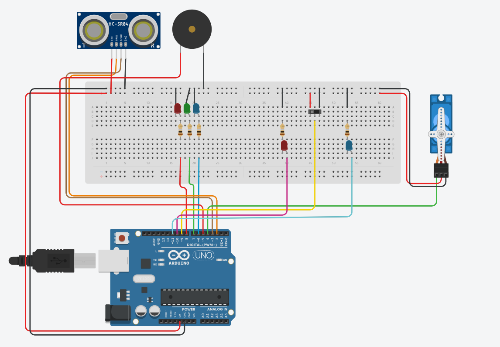
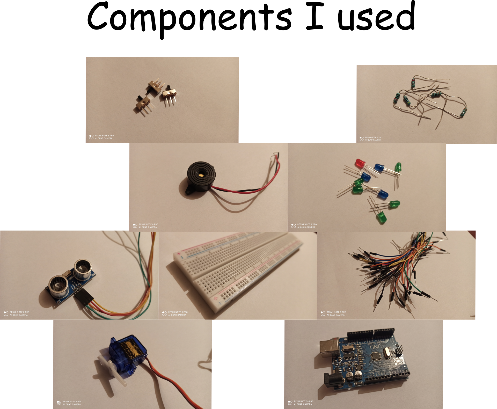

# Car parking sensor using Arduino Uno
* The system is based on an ultrasonic sensor with two components: transmitter and receiver. The signal is transmitted by sender and depending on time duration receiver senses it back you can know how far away an object is.

* Based on the object distance, there are 3 LEDs that indicates it optically, and a buzzer for alerting the driver about a possible obstacle.

* A servo-motor simulates the real braking system of a car, rotation of it meaning activation of brakes. If distance is under a safety value, the microcontroller sends to servo a signal for blocking the wheels. Another LED is then lighting telling us that wheels are blocked.

* All system can be deactivated using a switch, and a red LED indicates if it is ON or OFF.

* Schematic of project

* Components:

    * Arduino Uno R3
    * Servomotor SG 90
    * Ultrasonic Sensor HC-SR04
    * Buzzer
    * Breadbord
    * LEDs
    * Resistors
    * A lot of wires

* Here you can see a real testing of sytem:
    * https://youtu.be/Nil-0hfrTmA

